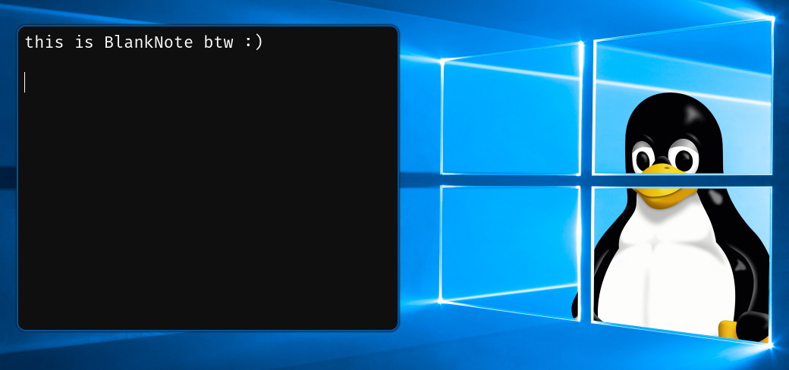

# BlankNote - a damn simple note taking app 

BlankNote is written in C with GTK4. It has no UI elements except the text view, controlled with keybindings.

# Building
Install `gtk4`, `fuzzel` (for running plugins with a fuzzel window)

Clone repo, run `make`, done!

To install system-wide run `sudo make install`

Also you can install .desktop and icon with `make desktop`, so BlankNote can be ran via app launcher 

For other options check `Makefile`

# Plugins
To develop plugins please check the plugin guidelines - [plugnis.md](https://github.com/fynjirby/blanknote/blob/master/plugins.md)

It is really simple to create one so it worth trying :)

# Usage
Run with `blanknote [file]`

## Keybindings
`Ctrl-plus` - Zoom text in

`Ctrl-minus` - Zoom text out

`Ctrl-0` - Reset zooming level to default

`Ctrl-O` - Open file picker

`Ctrl-S` - Save file

